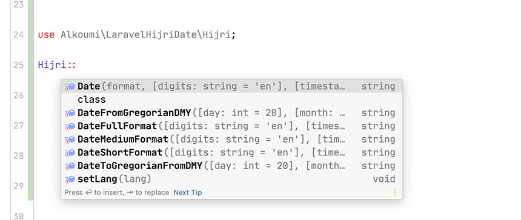

# Laravel Hijri Date `Ummul Qura` Calendar
#  تحويل التواريخ من و إلى التاريخ الهجري حسب تقويم أم القرى 

[](https://packagist.org/packages/alkoumi/laravel-hijri-date) [](https://packagist.org/packages/alkoumi/laravel-hijri-date)   


Laravel package to Convert laravel date to our Amazing 💝 Hjri date {ummul qura and vice versa} . to look like [ الخميس ، ٢٢ ربيع الآخر ، ١٤٤١ - ٠٧:٤٩ مساءً]
## Installation for all Laravel Versions 🥳

You can install the package via composer:

	composer require alkoumi/laravel-hijri-date

The service provider will automatically get registered. Or you may manually add the service provider in your `config/app.php` file:

    'providers' => [
        // ...
        Alkoumi\LaravelHijriDate\LaravelHijriDateServiceProvider::class,
    ];

## Usage


## Get Hijri Date with `Ummul Qura` calendar in `[Your Custom Format]`
You can simply get Ummul qura Hijri date directly in Your custom format using `Hijri::Date()` :

`Hijri::Date('format','timestamp')` accept tow parameters :

1- First parameter `'format'` is required 

2- Second parameter `'timestamp'` is optianl

```php
    // Choose Your Format Like 'l ، j F ، Y'
    // l => اليوم [الجمعة]
    // j => تاريخ اليوم الهجري [27]
    // m => رقم الشهر االهجري [09]
    // F => اسم الشهر الهجري [رمضان]
    // Y => السنة بالتاريخ الهجري [1442]
    // a => 'ص'
    // A => 'صباحًا'
    // H => الساعات
    // i => الدقائق
    // s => الثواني

    use Alkoumi\LaravelHijriDate\Hijri;

    Hijri::Date('l ، j F ، Y');                         // Without Defining Timestamp It will return Hijri Date of [NOW]  => Results "الجمعة ، 12 ربيع الآخر ، 1442"
    Hijri::Date('Y/m/d');                              // => Results "1442/04/12"
    Hijri::DateIndicDigits('l ، j F ، Y');              // Without Defining Timestamp It will return Hijri Date of [NOW] in Indic Digits => Results "الجمعة ، ١٢ ربيع الآخر ، ١٤٤٢"
    Hijri::DateIndicDigits('Y/m/d');                   //  => Results "١٤٤٢/٠٤/١٢"

    [OR]

    $date = Carbon::now()->addMonth();
    Hijri::Date('l ، j F ، Y', $date);                  // With optional Timestamp It will return Hijri Date of [$date] => Results "الأحد ، 12 جمادى الأول ، 1442"
    Hijri::Date('Y/m/d');                              // => Results "1442/04/12"
    Hijri::DateIndicDigits('l ، j F ، Y', $date);       // With optional Timestamp It will return Hijri Date of [$date] in Indic Digits => Results "الأحد ، ١٢ جمادى الأول ، ١٤٤٢"
    Hijri::DateIndicDigits('Y/m/d');                   //  => Results "١٤٤٢/٠٤/١٢"

```

## Get Hijri Date `Ummul Qura` Calendar `[Short Format]`
You can simply get Ummul qura Hijri date directly in Short Format 

`Hijri::ShortDate('timestamp')` accept One Optinal `'timestamp'` parameter :
```php
    use Alkoumi\LaravelHijriDate\Hijri;

    Hijri::ShortDate();                 // Without Defining Timestamp It will return Hijri Date of [NOW] => Results "1442/04/12"
    Hijri::ShortDateIndicDigits();      // Without Defining Timestamp It will return Hijri Date of [NOW] in Indic Digits => Results "١٤٤٢/٠٤/١٢"

    [OR]

    $date = Carbon::now()->addMonth();
    Hijri::ShortDate($date);                 // With optional Timestamp It will return Hijri Date of [$date] => Results "1442/05/12"
    Hijri::ShortDateIndicDigits($date);      // With optional Timestamp It will return Hijri Date of [$date] in Indic Digits => Results "١٤٤٢/٠٥/١٢"

```

## Get Hijri Date `Ummul Qura` Calendar `[Medium Format]`
You can simply get Ummul qura Hijri date directly in Medium Format 

`Hijri::MediumDate('timestamp')` accept One Optinal `'timestamp'` parameter :
```php
    use Alkoumi\LaravelHijriDate\Hijri;

    Hijri::MediumDate();                    // Without Defining Timestamp It will return Hijri Date of [NOW] => Results "الجمعة ، 12 ربيع الآخر ، 1442"
    Hijri::MediumDateIndicDigits();         // Without Defining Timestamp It will return Hijri Date of [NOW] in Indic Digits => Results "الجمعة ، ١٢ ربيع الآخر ، ١٤٤٢"

    [OR]

    $date = Carbon::now()->addMonth();
    Hijri::MediumDate($date);                 // With optional Timestamp It will return Hijri Date of [$date] => Results "الأحد ، 12 جمادى الأول ، 1442"
    Hijri::MediumDateIndicDigits($date);      // With optional Timestamp It will return Hijri Date of [$date] in Indic Digits => Results "الأحد ، ١٢ جمادى الأول ، ١٤٤٢"

```

## Get Hijri Date `Ummul Qura` Calendar `[Full Format]`
You can simply get Ummul qura Hijri date directly in Full Format

`Hijri::FullDate('timestamp')` accept One Optinal `'timestamp'` parameter :
```php
    use Alkoumi\LaravelHijriDate\Hijri;

    Hijri::FullDate();                    // Without Defining Timestamp It will return Hijri Date of [NOW] => Results "الجمعة ، 12 ربيع الآخر ، 1442 - 12:34:25 مساءً"
    Hijri::FullDateIndicDigits();         // Without Defining Timestamp It will return Hijri Date of [NOW] in Indic Digits => Results "الجمعة ، ١٢ ربيع الآخر ، ١٤٤٢ - ١٢:٣٤:٢٥ مساءً"

    [OR]

    $date = Carbon::now()->addMonth();
    Hijri::FullDate($date);                 // With optional Timestamp It will return Hijri Date of [$date] => Results "الأحد ، 12 جمادى الأول ، 1442 - 12:34:25 مساءً"
    Hijri::FullDateIndicDigits($date);      // With optional Timestamp It will return Hijri Date of [$date] in Indic Digits => Results "الأحد ، ١٢ جمادى الأول ، ١٤٤٢ - ١٢:٣٤:٢٥ مساءً"

```
#### Give Me 💗 Cup of ☕️ Coffee here https://patreon.com/mohammadelkoumi

